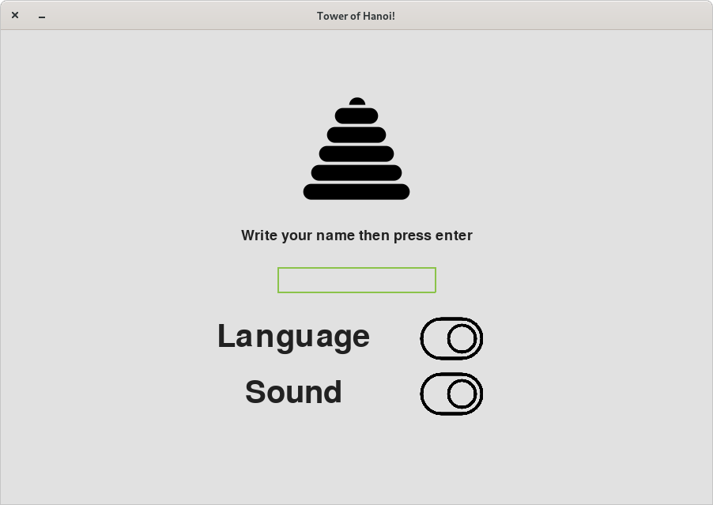
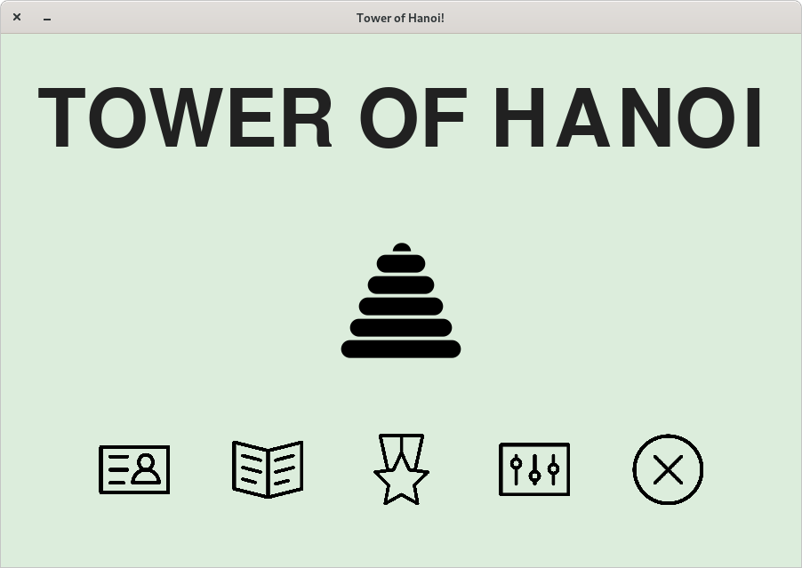
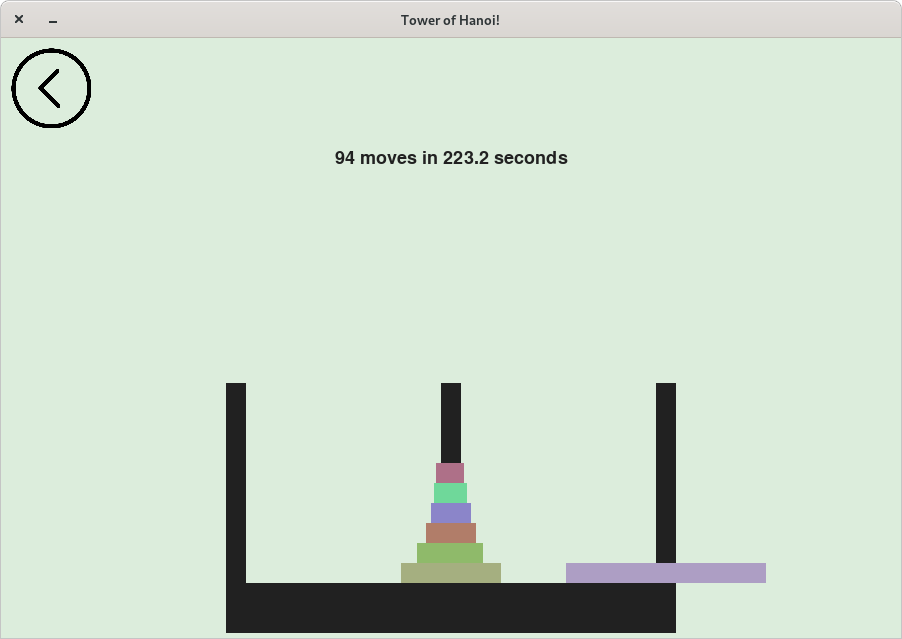
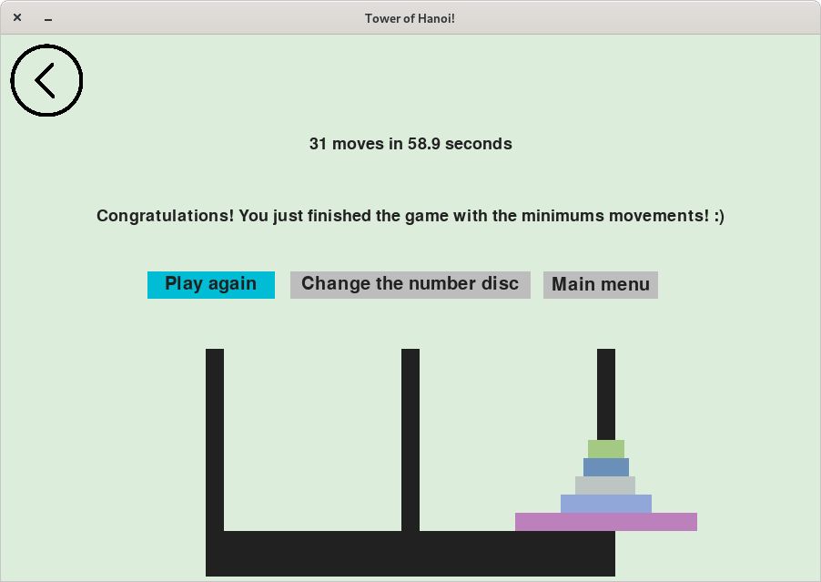
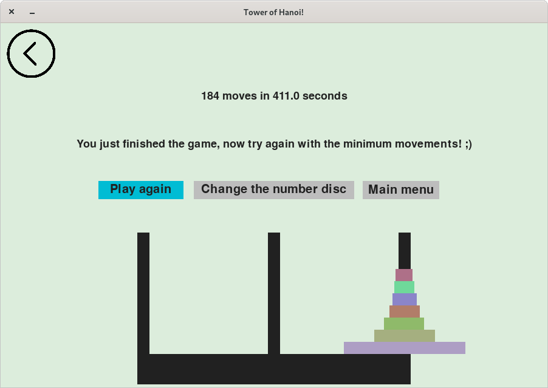
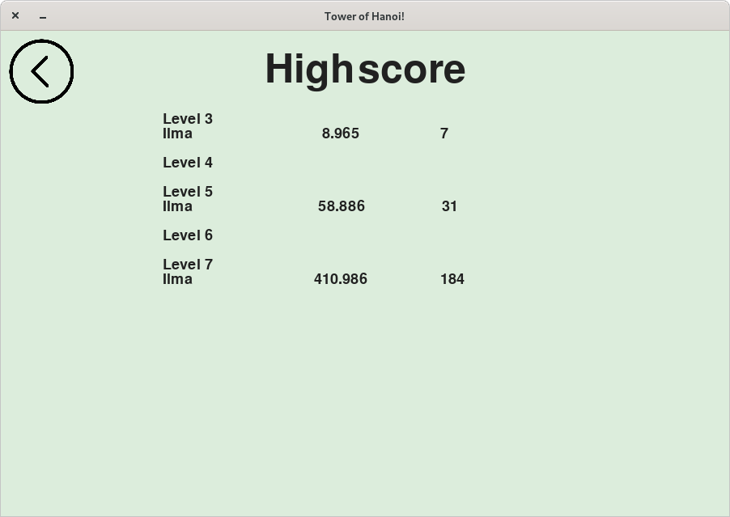

# towerofhanoi-game
A simple The Tower of Hanoi game using PyGame. This is a group assignment from Int. to Number Theory Course in ITB.

Sources used:
- Liu, D. The Tower of Hanoi. Retrieved from http://www2.mtsd.k12.wi.us/homestead/users/ordinans/Tower%20of%20Hanoi.html
- MG's Tower of Hanoi For Python. Retrieved from https://www.pygame.org/project/3191


## Installation
First thing first, make sure Python is installed.

After that, install latest `pygame` module, or run:
```
pip install -r requirements.txt
```

Then call the main script:
```
python3 run.py`
```

Enjoy!

## Features
- Select the number of pegs, form 3 to 7.
- Calculate the number of steps and time spent on each play
- Leaderboard
- Dual language, English and Bahasa (Indonesia)
- A nice music :)


## Screenshots

### The "login" screen



### The "home" screen



### The "play" screen



### The "game-over" screen



### Another "game-over" screen



### The "highscore" screen


